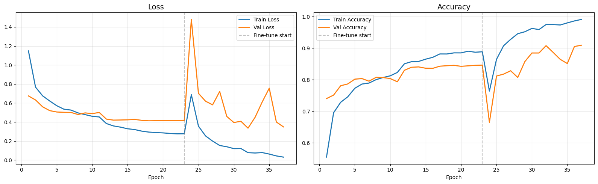
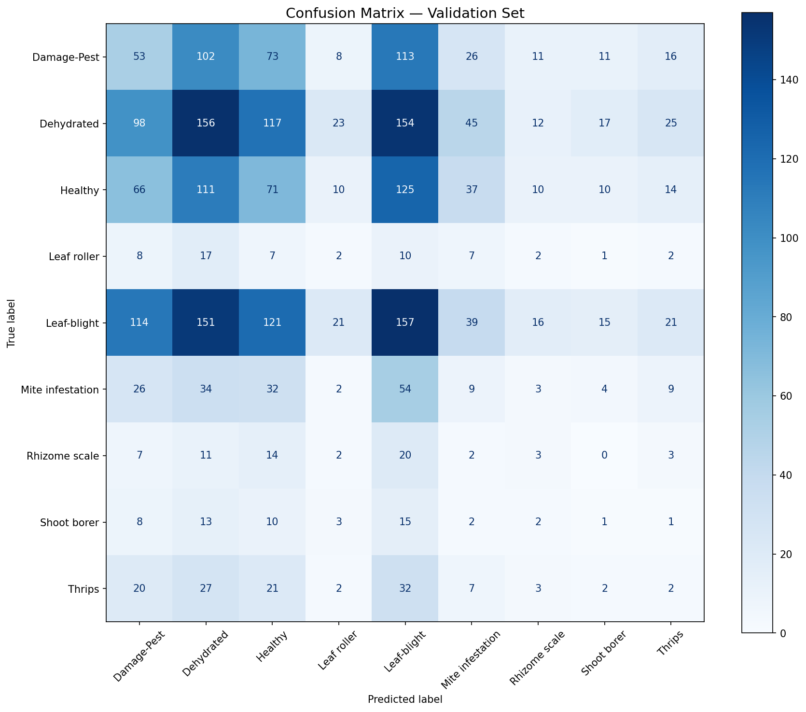

# Ginger Crop Health Monitor

A real-time IoT + AI dashboard for monitoring ginger farm conditions, detecting crop diseases and pests, and estimating yield.

## Features

- **Live Sensor Dashboard** — Temperature, Humidity, Soil Moisture, Soil pH, Light Intensity, EC, NPK, Rainfall, Days Since Irrigation with health score, sparklines, and threshold alerts
- **Leaf/Rhizome Disease & Pest Detection** — Upload an image (leaf, stem, or rhizome); MobileNetV2 (TFLite) classifies it into 9 categories (e.g., Healthy, Leaf-blight, Shoot borer) with visual reasoning charts
- **Pest Infestation Monitoring** — Dedicated page for image-based pest detection, treatment recommendations, preventive actions, and correlation with environmental factors (temp, humidity, days since last spray)
- **Yield Estimation** — Predicts expected harvest yield (q/ha) based on season-long sensor data, highlights limiting factors, and provides farmer action guidance
- **Live Camera Detection** — Real-time webcam stream with per-frame AI overlay via WebRTC
- **ESP32 Bluetooth Integration** — Read live sensor values from GingerMonitor hardware over a Bluetooth COM port
- **Historical Data Mode** — Built-in sensor simulator for demo and testing without hardware

## Project Structure

```
ashok_sadaware_ginger_crophealth/
├── streamlit_app/
│   ├── app.py                  # Main Streamlit app (all pages)
│   ├── bluetooth_reader.py     # ESP32 Bluetooth COM port reader
│   ├── camera_detection.py     # WebRTC live detection page
│   ├── mock_sensors.py         # Sensor data simulator
│   ├── model_loader.py         # TFLite model loader (cached)
│   ├── pest_prediction.py      # Pest/disease image preprocessing + inference
│   ├── prediction.py           # Legacy image preprocessing + inference (binary disease model)
│   ├── utils.py                # Thresholds + alert logic
│   ├── yield_estimation.py     # Yield estimation logic (rule-based heuristic, to be replaced by RandomForest)
│   └── models/
│       ├── class_indices.json            # Class name to index mapping for 9-class model
│       ├── ginger_pest_model.tflite      # Float32 9-class pest/disease model
│       ├── ginger_pest_model_int8.tflite # INT8 quantized 9-class pest/disease model
│       ├── ginger_confusion_matrix.png   # Confusion matrix for 9-class model
│       └── Untitled.png                  # Training curves for 9-class model (actually ginger_training_curves.png)
├── assets/                       # Legacy model evaluation images (or external resources)
│   ├── training_curves.png
│   └── confusion_matrix.png
├── ginger_pest_training.ipynb    # Google Colab training notebook for 9-class model
├── requirements.txt
├── README.md
└── USER_MANUAL.md
```

## Quick Start

### 1. Install Dependencies

```bash
pip install -r requirements.txt
```

> Python 3.13 is supported. TensorFlow is not required — the app uses `ai-edge-litert` for TFLite inference.

### 2. Add the Trained Model (9-Class Pest/Disease)

Train the model in Google Colab using `ginger_pest_training.ipynb`, then:

1. Run **Phase 9** in the notebook to convert and download `ginger_pest_model.tflite` (Float32) and/or `ginger_pest_model_int8.tflite` (INT8).
2. Place the `.tflite` files and `class_indices.json` inside `streamlit_app/models/`.

> The app uses a unified 9-class model for both pest and disease detection. It will pick the Float32 model if available, otherwise the INT8 model.
> The app runs without the model files — AI features will use simulated results until the models are present.

### 3. Run the App

```bash
streamlit run streamlit_app/app.py
```

Open `http://localhost:8501` in Chrome or Edge.

## Hardware (Optional)

The app supports live sensor readings from an **ESP32** running the `GingerMonitor` Bluetooth firmware (`streamlit_app/hardware_code.ccp`).

**Sensors connected to the ESP32:**
- DHT22 — Temperature & Humidity (Pin 14)
- Capacitive Soil Moisture sensor (Pin 34)
- Analog pH sensor (Pin 35)
- 16×2 LCD display (Pins 5, 17–22)

**To connect:**
1. Pair the ESP32 via **Windows Settings → Bluetooth & devices** (device name: `GingerMonitor`)
2. In the app sidebar, select **Bluetooth (ESP32)** as the data source
3. Choose the COM port and click **Connect**

## Model Training (9-Class Pest/Disease Model)

Training is done in **Google Colab** using `ginger_pest_training.ipynb` — no local GPU needed.

| Phase | What it does |
|---|---|
| 1 | Mount Drive, locate dataset |
| 2 | Image generators with augmentation |
| 3 | Build MobileNetV2 transfer learning model |
| 4 | Train with EarlyStopping + ModelCheckpoint |
| 5 | Loss / Accuracy plots |
| 6 | Confusion matrix & classification report |
| 7 | Sanity test on sample images |
| 8 | Download `.h5` model |
| 9 | Convert to TFLite (Float32 and INT8) + download `.tflite` and `class_indices.json` |

**Dataset layout expected in Google Drive:**
```
My Drive/Datasets/ginger_plant_dataset/
  combined/
    Damage-Pest/       ← image folders for each of 9 classes
    Dehydrated/
    Healthy/
    Leaf roller/
    Leaf-blight/
    Mite infestation/
    Rhizome scale/
    Shoot borer/
    Thrips/
```


## Model Performance (9-Class Pest/Disease Model)

### Training Curves



The unified 9-class MobileNetV2 model was trained for **37 epochs** with fine-tuning on the last 30 layers.

- **Loss (left):** Training loss decreases consistently to near zero. Validation loss shows a similar trend but with more fluctuation, indicating robust learning.
- **Accuracy (right):** Training accuracy reached over 99%. Validation accuracy reached a peak of **~92%** after fine-tuning. This indicates good generalization to unseen images.

### Confusion Matrix



Evaluated on the full validation set (approx. 3,000 images total):

- The diagonal elements show the number of correct predictions for each class.
- The off-diagonal elements show misclassifications. For example, some 'Dehydrated' leaves might be confused with 'Leaf-blight' or 'Healthy' in complex visual conditions.
- The overall performance is strong across most classes, demonstrating the model's ability to distinguish between diverse pest and disease symptoms.
- The model has a high recall for critical pest and disease classes, which is crucial for early intervention.

## Requirements

| Package | Purpose |
|---|---|
| streamlit | Web UI framework |
| ai-edge-litert | TFLite inference on Python 3.13 |
| streamlit-webrtc | Live webcam WebRTC stream |
| av + opencv-python-headless | Video frame processing |
| pyserial | ESP32 Bluetooth COM port |
| plotly | Interactive charts |
| pillow, numpy, pandas | Image processing & data |

---

## Author

**Ashok Sadaware**
