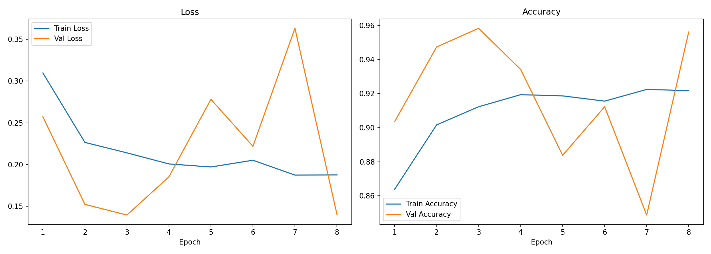
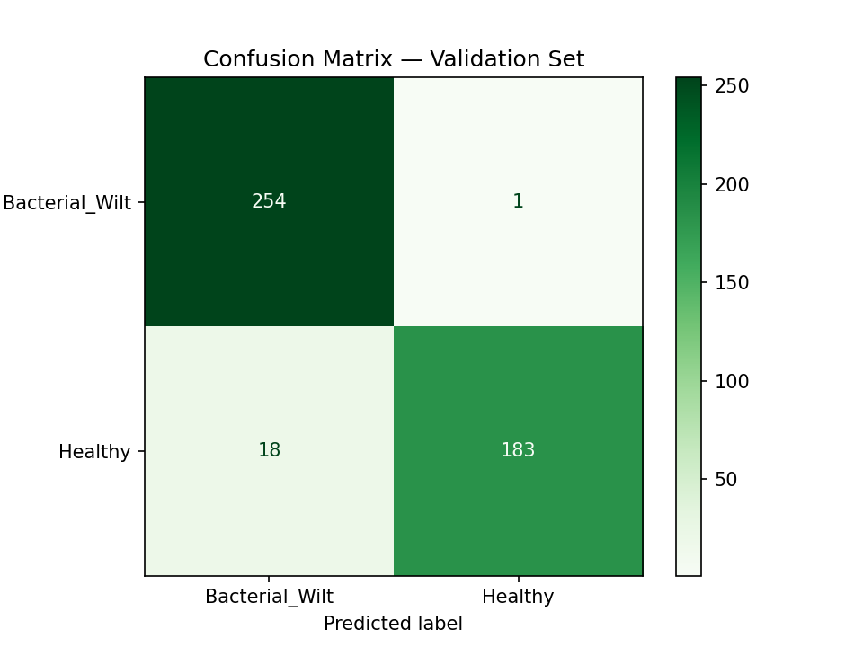

# Ginger Crop Health Monitor

A real-time IoT + AI dashboard for monitoring ginger farm conditions and detecting leaf disease using computer vision.

## Features

- **Live Sensor Dashboard** — Temperature, Humidity, Soil Moisture, Soil pH, Light Intensity with health score, sparklines, and threshold alerts
- **Leaf Disease Detection** — Upload a ginger leaf photo; MobileNetV2 (TFLite) classifies it as Healthy or Bacterial Wilt with visual reasoning charts
- **Live Camera Detection** — Real-time webcam stream with per-frame AI overlay via WebRTC
- **ESP32 Bluetooth Integration** — Read live sensor values from GingerMonitor hardware over a Bluetooth COM port
- **Historical Data Mode** — Built-in sensor simulator for demo and testing without hardware

## Project Structure

```
ashok_sadaware_ginger_crophealth/
├── streamlit_app/
│   ├── app.py                  # Main Streamlit app (all pages)
│   ├── bluetooth_reader.py     # ESP32 Bluetooth COM port reader
│   ├── camera_detection.py     # WebRTC live detection page
│   ├── mock_sensors.py         # Sensor data simulator
│   ├── model_loader.py         # TFLite model loader (cached)
│   ├── prediction.py           # Image preprocessing + inference
│   ├── utils.py                # Thresholds + alert logic
│   └── models/
│       └── ginger_disease_model.tflite   ← place trained model here
├── assets/
│   ├── training_curves.png     # Loss & accuracy plots from training
│   └── confusion_matrix.png    # Validation set confusion matrix
├── ginger_cnn_training.ipynb   # Google Colab training notebook
├── requirements.txt
├── README.md
└── USER_MANUAL.md
```

## Quick Start

### 1. Install Dependencies

```bash
pip install -r requirements.txt
```

> Python 3.13 is supported. TensorFlow is not required — the app uses `ai-edge-litert` for TFLite inference.

### 2. Add the Trained Model

Train the model in Google Colab using `ginger_cnn_training.ipynb`, then:

1. Run **Phase 9** in the notebook to convert and download `ginger_disease_model.tflite`
2. Place the file inside `streamlit_app/models/`

The app runs without the model file — AI features will be disabled until the model is present.

### 3. Run the App

```bash
streamlit run streamlit_app/app.py
```

Open `http://localhost:8501` in Chrome or Edge.

## Hardware (Optional)

The app supports live sensor readings from an **ESP32** running the `GingerMonitor` Bluetooth firmware (`streamlit_app/hardware_code.ccp`).

**Sensors connected to the ESP32:**
- DHT22 — Temperature & Humidity (Pin 14)
- Capacitive Soil Moisture sensor (Pin 34)
- Analog pH sensor (Pin 35)
- 16×2 LCD display (Pins 5, 17–22)

**To connect:**
1. Pair the ESP32 via **Windows Settings → Bluetooth & devices** (device name: `GingerMonitor`)
2. In the app sidebar, select **Bluetooth (ESP32)** as the data source
3. Choose the COM port and click **Connect**

## Model Training

Training is done in **Google Colab** — no local GPU needed.

| Phase | What it does |
|---|---|
| 1 | Mount Drive, locate dataset |
| 2 | Image generators with augmentation |
| 3 | Build MobileNetV2 transfer learning model |
| 4 | Train with EarlyStopping + ModelCheckpoint |
| 5 | Loss / Accuracy plots |
| 6 | Confusion matrix & classification report |
| 7 | Sanity test on sample images |
| 8 | Download `.h5` model |
| 9 | Convert to TFLite + download `.tflite` |

**Dataset layout expected in Google Drive:**
```
My Drive/Datasets/ginger_plant_dataset/
  train/
    Bacterial_Wilt/   ← diseased leaf images
    Healthy/          ← healthy leaf images
```

## Model Performance

### Training Curves



The model was trained for **8 epochs** before EarlyStopping halted training.

- **Loss (left):** Training loss decreases steadily from ~0.31 to ~0.19, showing the model is learning consistently. Validation loss fluctuates due to the relatively small dataset size but trends downward overall.
- **Accuracy (right):** Training accuracy rises from ~86% to ~92%. Validation accuracy peaks at **~95.6%** at epoch 8 — the best checkpoint saved by ModelCheckpoint. The oscillation in validation accuracy is expected with a small validation set where each misclassified image has a larger percentage impact.

### Confusion Matrix



Evaluated on the validation set (456 images total):

| | Predicted Bacterial Wilt | Predicted Healthy |
|---|---|---|
| **Actual Bacterial Wilt** | ✅ 254 (True Positive) | ❌ 1 (False Negative) |
| **Actual Healthy** | ❌ 18 (False Positive) | ✅ 183 (True Negative) |

**Key metrics:**

| Metric | Bacterial Wilt | Healthy |
|---|---|---|
| Precision | 93.4% (254/272) | 99.5% (183/184) |
| Recall | **99.6%** (254/255) | 91.0% (183/201) |
| F1-Score | ~96.4% | ~95.1% |

**Overall validation accuracy: 95.6%**

The model correctly identifies 254 out of 255 Bacterial Wilt cases — only 1 diseased leaf was missed (false negative). The 18 false positives (healthy leaves predicted as diseased) are acceptable in a disease-detection context where missing a real disease case is more costly than a false alarm. The high Bacterial Wilt recall makes this model well-suited for field use.

## Requirements

| Package | Purpose |
|---|---|
| streamlit | Web UI framework |
| ai-edge-litert | TFLite inference on Python 3.13 |
| streamlit-webrtc | Live webcam WebRTC stream |
| av + opencv-python-headless | Video frame processing |
| pyserial | ESP32 Bluetooth COM port |
| plotly | Interactive charts |
| pillow, numpy, pandas | Image processing & data |

---

## Author

**Ashok Sadaware**
